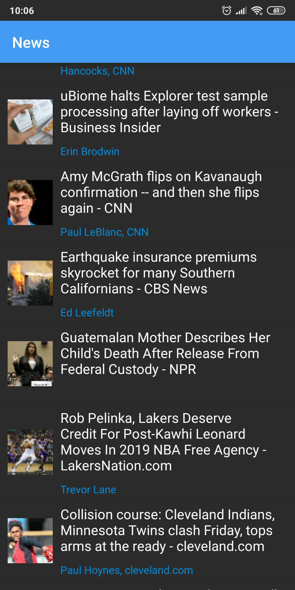

In app you can use quick view for fast open url in dialog webview. Then you can open the url in a regular browser if you need it.

##Simple News App

## Description

An in-depth paragThis a simple news android app using google news api for get top headlines news. This portfolio project was created to show how easy it is to work with Kotlin and Google Api.raph about your project and overview of use.

<p align="left">
  
</p>

### Dependencies

* [Google news Api](https://newsapi.org/s/google-news-api) 
for get news

* [Picasso Librarry](https://github.com/square/picasso) 
for easy set img from url

* [Okhttp3](https://github.com/square/okhttp/tree/master/okhttp/src/main/java/okhttp3) 


### Installing

* How/where to download your program
* Any modifications needed to be made to files/folders

### Executing program

* How to run the program
* Step-by-step bullets
```
code blocks for commands
```

## Help

Any advise for common problems or issues.
```
command to run if program contains helper info
```

## Daniil Nosyk

Contributors names and contact info

ex. [@DomPizzie](https://twitter.com/dompizzie)

## Version History

* 0.2
    * Various bug fixes and optimizations
    * See [commit change]() or See [release history]()
* 0.1
    * Initial Release

## License

This project is licensed under the [NAME HERE] License - see the LICENSE.md file for details

## Acknowledgments

Inspiration, code snippets, etc.
* [awesome-readme](https://github.com/matiassingers/awesome-readme)
* [PurpleBooth](https://gist.github.com/PurpleBooth/109311bb0361f32d87a2)
* [dbader](https://github.com/dbader/readme-template)
* [zenorocha](https://gist.github.com/zenorocha/4526327)
* [fvcproductions](https://gist.github.com/fvcproductions/1bfc2d4aecb01a834b46)
